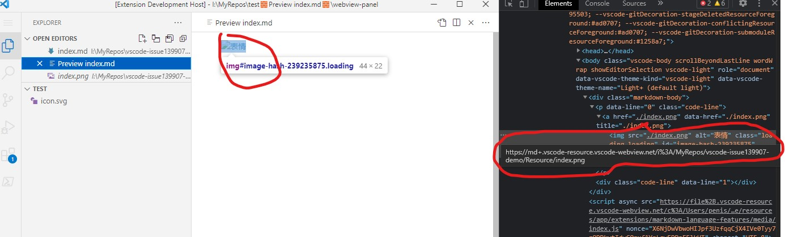
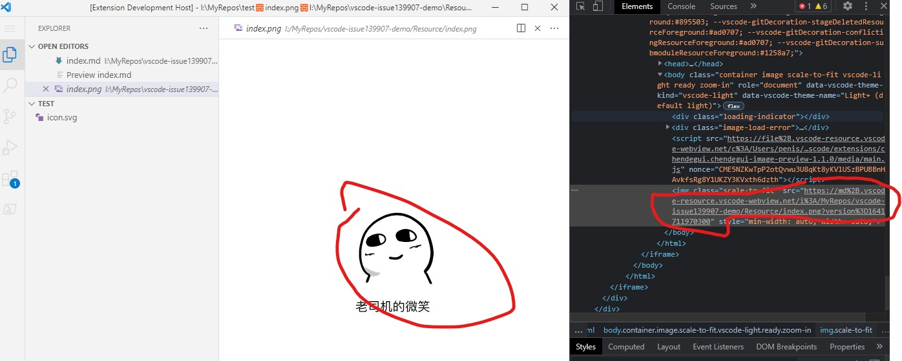

[vscode-issue139907-demo](https://github.com/microsoft/vscode/issues/139907)

# issue 139907 Reproduce steps
- debug this extension
- open index.md in Resource Folder
- execute command "ChenDeGui: chendegui.vscode-issue139907-demo" from command palette
- thus you open a index.md from fileSystemProvider
- ctl+shift+v to open markdown preview
- the image won't show, and you click the image placehoder，the image will open, it is also privided by fileSystemProvider
